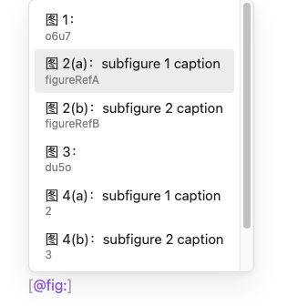
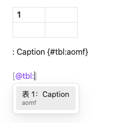
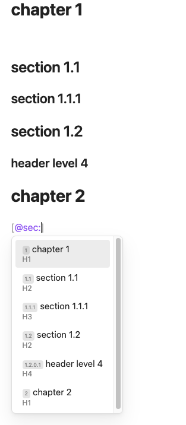

# Easy Reference

A comprehensive Obsidian plugin that provides automatic referencing for figures, tables, and sections with pandoc-crossref compatibility.

## Features

- **Automatic Figure Referencing**: Automatically adds figure labels and references in pandoc-crossref format
- **Table Referencing**: Smart table detection and automatic label generation
- **Section Referencing**: Reference headings and sections with auto-generated IDs
- **Intelligent Suggestions**: Auto-completion system for cross-references
- **Pandoc Compatibility**: Full support for pandoc-crossref syntax and configuration
- **Flexible Configuration**: Customizable reference styles and formats
- **Image Processing**: Supports both Wiki-style and Markdown image links
- **Multi-format Export**: Seamless integration with pandoc toolchain for various output formats

## Installation

### From Obsidian Community Plugins

1. Open Obsidian Settings
2. Navigate to Community Plugins
3. Search for "Easy Reference"
4. Install and enable the plugin

### Manual Installation

1. Download the latest release from the [releases page](https://github.com/mcardZH/EasyReference/releases)
2. Extract the files to your vault's `.obsidian/plugins/easy-reference/` directory
3. Enable the plugin in Obsidian settings

## Dependencies

This plugin works best with the following tools:
- **pandoc**: For document conversion
- **pandoc-crossref**: For cross-reference processing
- **Enhancing Export** (recommended): For enhanced export functionality
- **Image Converter** (optional): For image processing workflow

## Usage

### Basic Setup

1. Install the required dependencies (pandoc and pandoc-crossref)
2. Enable the plugin in Obsidian
3. Configure your reference styles in the plugin settings

### Figure References

The plugin automatically processes images and adds figure labels:

```markdown
{#fig:fig123}
```

You can then reference this figure using:
```markdown
See [@fig:fig123] for details.
```





### Table References

When you create a table, the plugin automatically adds a caption with reference:

```markdown
| Column 1 | Column 2 |
|----------|----------|
| Data 1   | Data 2   |

: Table caption {#tbl:tbl123}
```

Reference the table with:
```markdown
Refer to [@tbl:tbl123] for the data.
```



### Section References

Add reference labels to your headings:

```markdown
# Introduction {#sec:intro}

## Methodology {#sec:method}
```

Reference sections with:
```markdown
As discussed in [@sec:intro], we will explore...
```



### Auto-completion

The plugin provides intelligent suggestions when typing references:

1. Type `[@` to trigger the suggestion system
2. Type the reference type (`fig`, `tbl`, `sec`)
3. Type `:` followed by partial ID
4. Select from the suggested references

### Configuration

#### Reference Styles

Customize your reference formats in the plugin settings:

- **Figure Reference Style**: `fig{tag:3}` (generates random 3-character IDs)
- **Table Reference Style**: `tbl{tag:3}`
- **Section Reference Style**: `sec{tag:3}`

#### Pandoc-Crossref Settings

Configure pandoc-crossref options directly in the plugin:

- **Figure Title**: Prefix for figure captions (e.g., "Figure")
- **Table Title**: Prefix for table captions (e.g., "Table")
- **Reference Prefixes**: Customize how references appear in text
- **Link References**: Enable hyperlinks to referenced elements

#### Auto-generation Settings

- **Auto-add Figure References**: Automatically add labels to all images
- **Auto-add Table References**: Automatically add labels to all tables
- **Markdown Link Style**: Convert Wiki-style links to Markdown format
- **Relative Paths**: Use simplified file paths for images

### Advanced Features

#### Frontmatter Configuration

Control plugin behavior per document using frontmatter:

```yaml
---
autoAddFigRef: true
autoAddTblRef: true
figureTitle: "图"
tableTitle: "表"
---
```

#### Update Frontmatter Command

Use the "Update Frontmatter" command to automatically add pandoc-crossref configuration to your document's frontmatter.

#### Sub-figure Support

The plugin supports sub-figures with special formatting:

```markdown
<div id="fig:subfig">
{#fig:subfig-a}
{#fig:subfig-b}
</div>
```

### Integration with Export Workflow

1. Configure your reference styles in the plugin
2. Use the "Update Frontmatter" command to add pandoc-crossref settings
3. Export your document using Enhanced Export or pandoc directly
4. The plugin's configuration will be applied during the export process

## Settings

### Reference Formatting

- **Figure Reference Style**: Template for figure ID generation
- **Table Reference Style**: Template for table ID generation
- **Section Reference Style**: Template for section ID generation

### Automation

- **Auto-add Figure References**: Enable/disable automatic figure labeling
- **Auto-add Table References**: Enable/disable automatic table labeling
- **Markdown Link Style**: Convert Wiki links to Markdown format
- **Image Name Format**: Template for saved image names

### Pandoc Integration

- **Figure Title**: Caption prefix for figures
- **Table Title**: Caption prefix for tables
- **Reference Prefixes**: How references appear in text
- **Link References**: Create hyperlinks to referenced elements

## Variables

The plugin supports several variables for customization:

- `{filename}`: Current file name without extension
- `{index}`: Auto-incrementing number to avoid duplicates
- `{ext}`: File extension
- `{tag:n}`: Random n-character alphanumeric string

## Troubleshooting

### Common Issues

1. **References not working**: Ensure pandoc-crossref is installed and configured
2. **Images not converting**: Check if "Markdown Link Style" is enabled
3. **Auto-references not appearing**: Verify auto-add settings are enabled
4. **Export issues**: Confirm frontmatter is updated with correct configuration

### Compatibility

- Works with Image Converter plugin for enhanced image processing
- Compatible with Enhanced Export for improved export functionality
- Requires pandoc and pandoc-crossref for full functionality

## Contributing

Contributions are welcome! Please feel free to submit issues, feature requests, or pull requests.

## License

This project is licensed under the MIT License - see the [LICENSE](LICENSE) file for details.

## Author

**mcardZH** - [GitHub Profile](https://github.com/mcardZH/)

## Support

If you find this plugin helpful, please consider:
- ⭐ Starring the repository
- 🐛 Reporting bugs or issues
- 💡 Suggesting new features
- 📝 Contributing to the documentation

---

*This plugin is designed to work seamlessly with pandoc and pandoc-crossref for academic and professional document preparation.*
